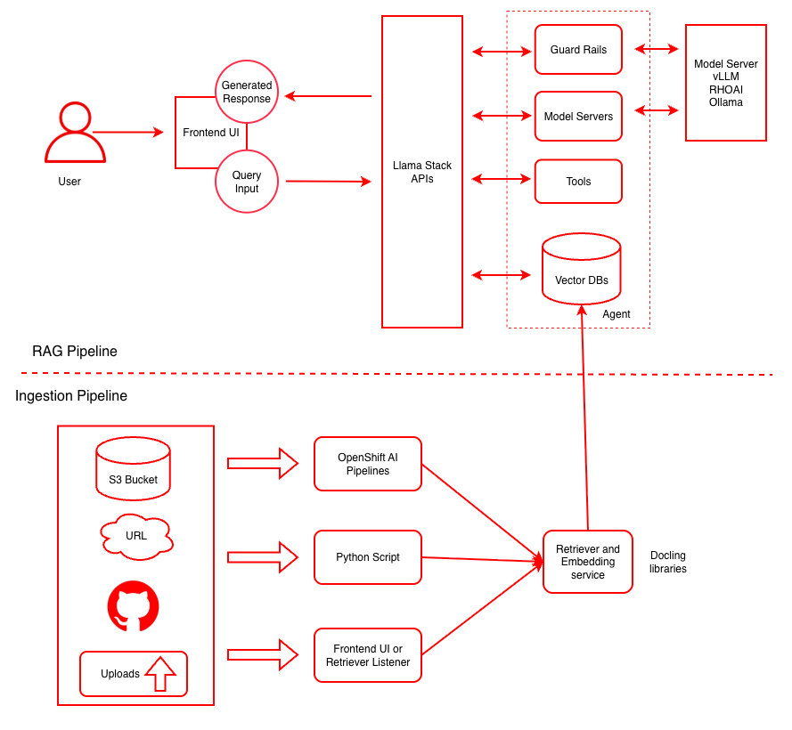

<!-- omit from toc -->
# RAG Reference Architecture

This document provides a detailed reference architecture for the RAG QuickStart, including component identification, workflow descriptions, and deployment patterns.

<!-- omit from toc -->
## Table of Contents
- [Architecture Overview](#architecture-overview)
- [System Components](#system-components)
- [RAG Pipeline Components](#rag-pipeline-components)
  - [Frontend UI](#frontend-ui)
  - [Query Input](#query-input)
  - [Input Safety Shield](#input-safety-shield)
  - [Query Processing/Routing](#query-processingrouting)
  - [Retriever and Embedding Service](#retriever-and-embedding-service)
  - [Vector Database](#vector-database)
  - [Retriever and Reranking](#retriever-and-reranking)
  - [LLM Response Generation](#llm-response-generation)
  - [Output Safety Shield and Validator](#output-safety-shield-and-validator)
  - [Generated Response](#generated-response)
- [Ingestion Pipeline Components](#ingestion-pipeline-components)
  - [Document Sources](#document-sources)
  - [Processing Methods](#processing-methods)
  - [Document Processing and Embedding Service](#document-processing-and-embedding-service)
- [Deployment Architecture](#deployment-architecture)
- [Implementation Technologies](#implementation-technologies)

## Architecture Overview

*The diagram illustrates both the ingestion pipeline for document processing and the RAG pipeline for query handling.*

## System Components

The architecture consists of two main workflow pipelines:

1. **RAG Pipeline** - Handles user queries and generates responses
2. **Ingestion Pipeline** - Processes documents and updates the knowledge base

## RAG Pipeline Components

### Frontend UI
- Provides the user interface for submitting queries and viewing responses
- Communicates with the backend services via REST APIs
- Can be deployed as a separate pod from the main application logic

### Query Input
- Captures user queries from the frontend
- Formats queries for downstream processing

### Input Safety Shield
- Screens incoming queries for harmful content, manipulative prompts, or injection attacks
- Implements content moderation to detect inappropriate requests
- May use a combination of rule-based filters and ML models
- Rejects or sanitizes potentially harmful queries

### Query Processing/Routing
- Routes queries to appropriate retrieval systems

### Retriever and Embedding Service
- Converts queries into vector embeddings using chunks
- Interfaces with the vector database for similarity search
- May include cross-encoders for more accurate retrieval
- Can be implemented using frameworks like LangChain

### Vector Database
- Stores document embeddings and metadata
- Performs efficient similarity searches
- Deployed as a separate container/pod

### Retriever and Reranking
- Takes initial retrieval results and improves them
- Reranks documents based on relevance to the query
- May filter out irrelevant or redundant information
- Optimizes context for the LLM
- Not yet implemented by Llama Stack

### LLM Response Generation
- Processes the query and retrieved context to generate a response
- Formats prompts with appropriate instructions and context
- Interfaces with the LLM service (e.g., vLLM running Llama models)

### Output Safety Shield and Validator
- Screens generated responses for harmful content
- Verifies factual accuracy and alignment with retrieved information
- Checks for hallucinations or unsupported claims
- Ensures responses meet safety and compliance requirements

### Generated Response
- The final, validated response delivered to the user
- Formatted appropriately for presentation in the UI
- May include citations or references to source material
- Could incorporate confidence scores or alternative answers

## Ingestion Pipeline Components

### Document Sources
- **S3 Bucket**: Cloud storage for document files
- **URL**: Documents for download
- **Uploads**: Direct file uploads from users via the frontend

### Processing Methods
- **OpenShift AI Pipelines**: Orchestrated workflows for complex document processing
- **Python Script**: Custom scripts for specialized document handling
- **Frontend UI or Retriever Listener**: User-triggered document processing

### Document Processing and Embedding Service
- Chunks documents into appropriate segments using Docling
- Generates embeddings for each chunk
- Handles document metadata extraction
- Prepares data for insertion into the vector database

## Deployment Architecture

This reference architecture can be deployed in OpenShift with the following pod structure:

| Pod Type | Purpose | Key Characteristics |
|----------|---------|---------------------|
| **Frontend** | User interface | Contains the UI, communicates with Application Pod via APIs |
| **Input Safety Shield** | Input content moderation | Screens incoming queries for harmful content, implements query validation and sanitization, can be independently scaled |
| **Application (llama-stack)** | RAG orchestration | Houses core RAG logic, implements query processing and response generation, contains LangChain implementation for retrieval and reranking |
| **LLM Service** | Language model inference | Runs vLLM with Llama models, optimized for GPU utilization, deployed via KServe InferenceService |
| **Vector Database** | Embedding storage and search | Manages PGVector store for document embeddings, handles similarity search requests, requires persistent storage, deployed as StatefulSet |
| **Output Safety Shield** | Output content validation | Screens generated responses for harmful content, verifies factual accuracy and alignment, can be independently scaled |
| **Embedding Service** | Vector embeddings | Generates embeddings for documents and queries, may be combined with document processing components, scales based on workload |
| **Ingestion Pipeline** | Document processing | Handles workflows via Kubeflow Pipelines, uses batch processing for large document sets, connected to S3-compatible storage (MinIO) |

## Implementation Technologies

The RAG QuickStart uses the following technology stack:

| Component                  | Technology                                      |
|----------------------------|-------------------------------------------------|
| **Application Framework**  | Llama Stack                                     |
| **LLM Service**            | vLLM with meta-llama/Llama-3.2-3B-Instruct     |
| **Vector Database**        | PostgreSQL + PGVector                           |
| **Container Orchestration**| OpenShift + OpenShift AI                        |
| **RAG Framework**          | LangChain, LlamaIndex                           |
| **Safety Models**          | meta-llama/Llama-Guard-3-8B                     |
| **Embedding Model**        | all-MiniLM-L6-v2                                |
| **Document Processing**    | Docling                                         |
| **Pipeline Orchestration** | Kubeflow Pipelines                              |
| **Object Storage**         | MinIO (S3-compatible)                           |
